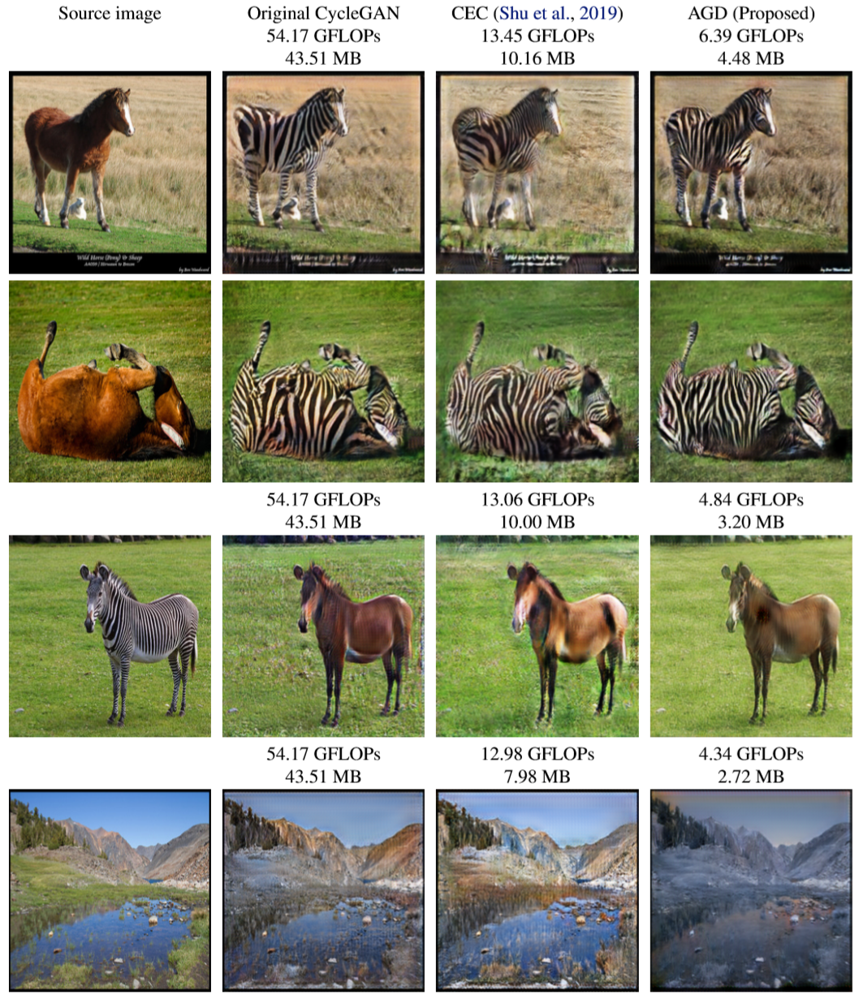
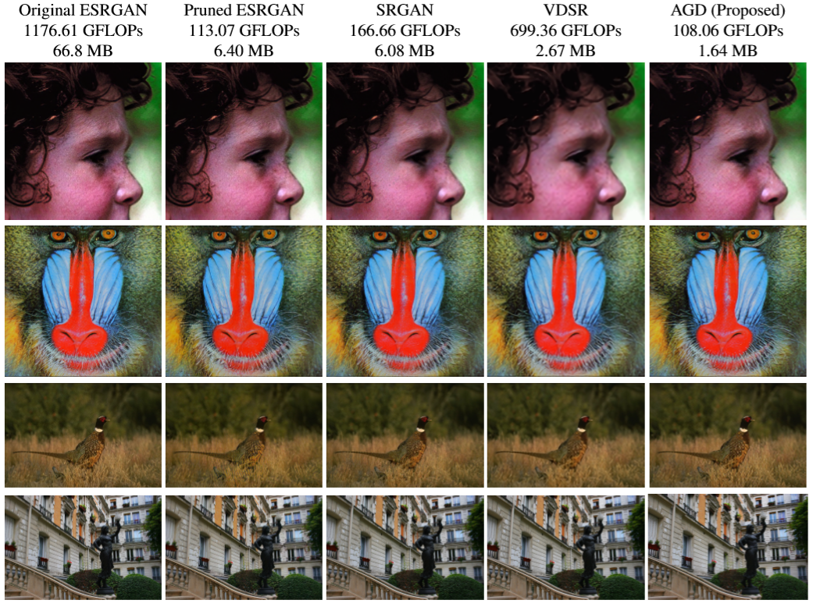

# AutoGAN-Distiller
Yonggan Fu,  Wuyang Chen, Haotao Wang, Haoran Li, Yingyan Lin, Zhangyang Wang

Accepted at ICML 2020 [[Paper Link]](https://arxiv.org/abs/2006.08198).

## Overview
We propose **AutoGAN-Distiller (AGD)** Framework, among the first AutoML frameworks dedicated to GAN compression, and is also among a few earliest works that explore AutoML for GANs. 

## Method
* AGD is established on a specifically designed search space of efficient generator building blocks, leveraging knowledge from state-of-the-art GANs for different tasks. 
* It performs differentiable neural architecture search under the target compression ratio (computational resource constraint), which preserves the original GAN generation quality via the guidance of knowledge distillation. 
* We demonstrate AGD on two representative mobile-based GAN applications: unpaired image translation (using a CycleGAN), and super resolution (using an encoder-decoder GAN).

## Visualization Results
**Unpaired image translation:**



**Super Resolution:**




## Datasets
### Unpaired Image Translation
horse2zebra, zebra2horse, summer2winter, winter2summer: [Unpaired-dataset](https://drive.google.com/file/d/1L6wmLIOyRRfvwspoWG-7li-sEgXmN76i/view?usp=sharing)

### Super Resolution
Training (DIV2K+Flickr2K): [SR-training-dataset](https://drive.google.com/file/d/1cGMxBwZF0FebHEjvf59L7ipDCeHWihcL/view?usp=sharing)

Evaluation (Set5, Set14, BSD100, Urban100): [SR-eval-dataset](http://vllab.ucmerced.edu/wlai24/LapSRN/results/SR_testing_datasets.zip)

## Usage
### Overview
`AGD_ST` and `AGD_SR` are the source codes for unpaired image translation task and super resolution task respectively. The codes for pretrain, search, train from scratch and eval are in the `AGD_ST/search` and `AGD_SR/search` directory.

We use `AGD_ST/search` as an example. All the configurations during pretrain, search, train from scratch, eval are in `config_search.py`, `config_train.py` and `config_eval.py` respectively. Please specify the target dataset `C.dataset` and change the dataset path `C.dataset_path` in the three config files to the real paths on your PC.

### Prerequisites
See `env.yml` for the complete conda environment. Create a new conda environment:
```
conda env create -f env.yml
conda activate pytorch
```
In partiqular, if the thop package encounters some version conflicts, please specify the thop version:
```
pip install thop==0.0.31.post1912272122
```

### Step 1: Pretrain the Supernet
* Switch to the `search` directory:
```
cd AGD_ST/search
```
* Set `C.pretrain = True` in `config_search.py`.

* Start to pretrain:
```
python train_search.py
```
The checkpoints during pretraining are saved at `./ckpt/pretrain`.

### Step 2: Search
* Set `C.pretrain = 'ckpt/pretrain'` in `config_search.py`.

* Start to search:
```
python train_search.py
```

### Step 3: Train the derived network from scratch
* Set `C.load_path = 'ckpt/search'` in `config_train.py`.

* Start to train from scratch:
```
python train.py
```

### Step 4: Eval
* Set `C.load_path = 'ckpt/search'` and `C.ckpt = 'ckpt/finetune/weights.pt'` in `config_eval.py`.
* Start to evaluate on the testing dataset:
```
python eval.py
```
The result images are saved at `./output/eval/`.

### Two differences in Super Resolution tasks
#### 1st Difference 
Please download the checkpoint of original ESRGAN (teacher model) from [pretrained ESRGAN](https://drive.google.com/file/d/1tbcKu0Knpj6X7bb_mcm5sH8JJVKva7sr/view?usp=sharing) and move it to the directory `AGD_SR/search/ESRGAN/`.

#### 2nd Difference
The step 3 is splitted into two steps, i.e., first pretrain the derived architecture with only content loss and then finetune with perceptual loss:

* Pretrain: Set `C.pretrain = True` in `config_train.py`.

* Finetune: Set `C.pretrain = 'ckpt/finetune_pretrain/weights.pt'` in `config_train.py`.


## Pretrained Models
Pretrained models are provided at [AGD_pretrained](https://drive.google.com/file/d/16jPN3isuoH8X9Q2OsN038zCXMnaMA1yj/view?usp=sharing).

To evaluate the pretrained models, please copy the network architecture definition and pretrained weights to the corresponding directories:
```
cp arch.pt ckpt/search/
cp weights.pt ckpt/finetune/
```

then do the evaluation following step 4.
